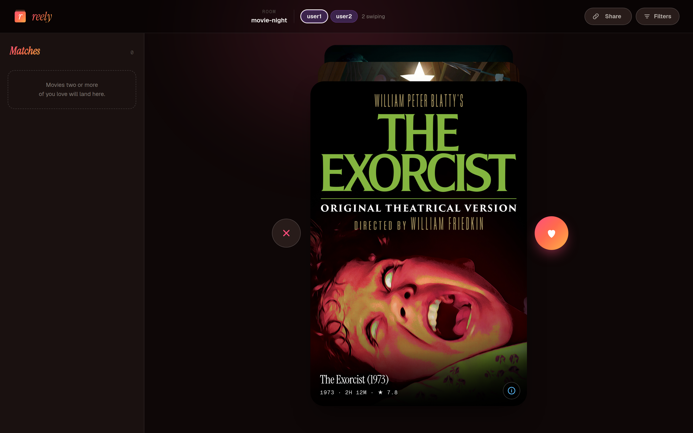
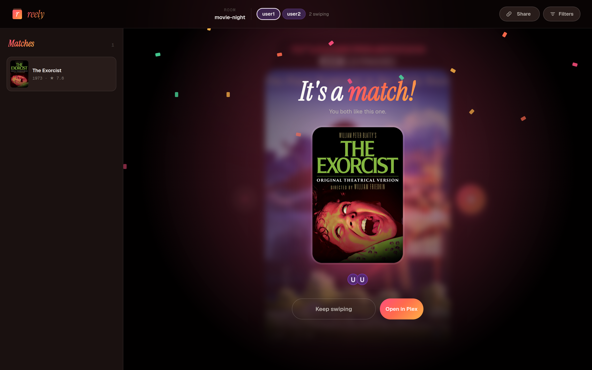
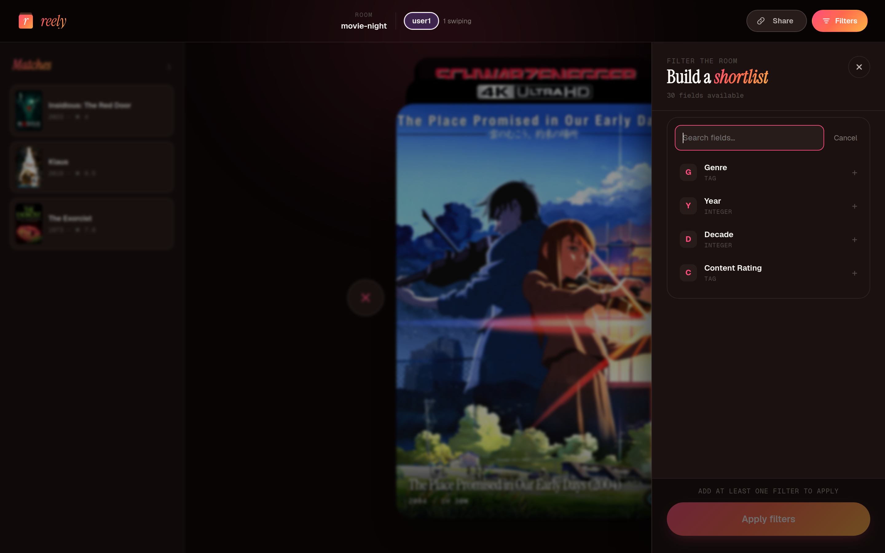
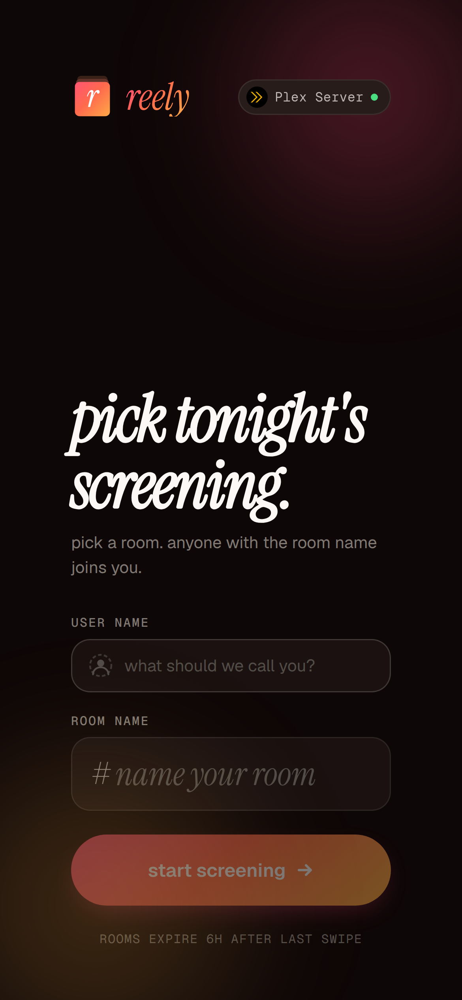
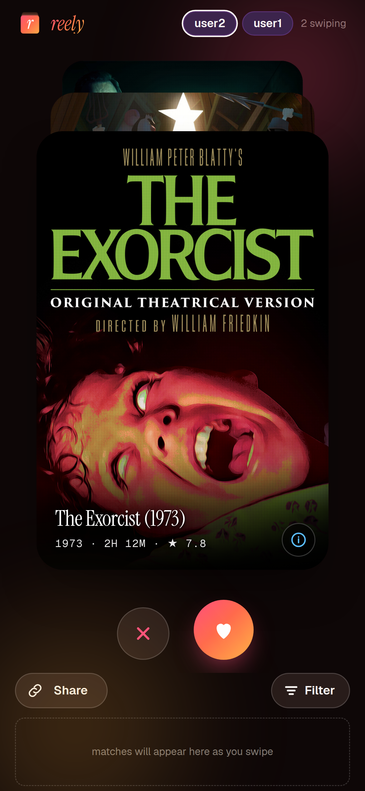
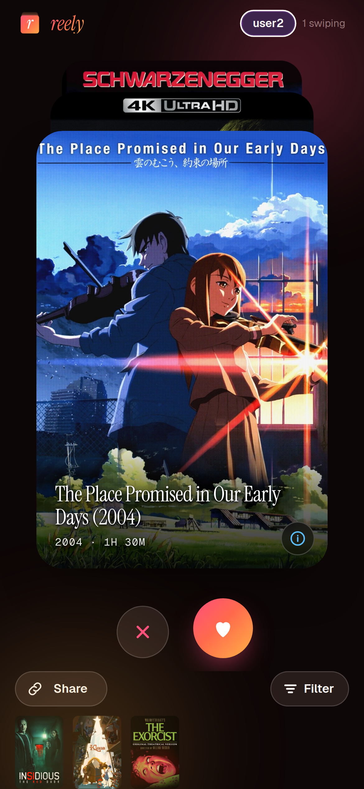

<p align="center">
  
</p>

<p align="center">pick tonight's screening.</p>

**reely** is a self-hosted movie night picker for your [Plex](https://www.plex.tv)
server. Everyone joins a room and swipes through the same shuffled list
of your movies -- right to like, left to pass. The moment two or more
people like the same title, it's a match. No more spending longer
choosing a movie than watching one.

reely is a community continuation of
[MovieMatch](https://github.com/LukeChannings/moviematch) by Luke
Channings, picking up from the last upstream release before the project
was abandoned in 2021.

- **No accounts, no passwords.** Join with a name and a room name;
  anyone who enters the same room name swipes with you. Rooms expire
  six hours after the last swipe.
- **Your Plex, kept private.** All Plex traffic happens server-side.
  The token never reaches a browser and is redacted from every log
  line.
- **Filters for the whole room.** Genre, year, decade, rating, and
  more -- anyone can apply a shortlist and everyone swipes the same
  deck.
- **Phone and desktop.** An installable PWA with swipe gestures on
  mobile, a two-pane layout with a live match sidebar on desktop.
- **Local-only.** No telemetry, no external services; it works without
  internet access once it's running.

## Screenshots

### Desktop







### Mobile

| Join | Swipe | Match | Collected matches |
|---|---|---|---|
|  |  |  |  |

## Run it

A `docker-compose.yml` is included at the repo root:

1. Copy `docker-compose.yml` from this repo.
2. Create a `secrets/` directory with a plain-text file (one value per
   file, no quotes):
   ```
   secrets/plex_token.txt      <- your Plex token
   ```
3. Set `PLEX_URL` in `docker-compose.yml` to your Plex server URL.
4. Run: `docker compose up -d`
5. Open <http://localhost:8000>, enter a name and a room name, and
   share the room name with whoever's picking with you.

Or directly:

```sh
docker run -it \
  -e PLEX_URL=http://your-plex:32400 \
  -e PLEX_TOKEN=your-plex-token \
  -p 8000:8000 \
  cajunflavoredbob/reely:latest
```

## Configuration

reely can be configured via environment variables or a `config.yaml`
file; environment variables override YAML settings. There is no
in-browser setup -- an unconfigured server shows a static notice telling
you to set the configuration and restart.

| Variable | Docker secret name | Description | Required | Default |
|---|---|---|---|---|
| `PLEX_URL` | - | URL of your Plex server, e.g. `http://192.168.1.10:32400` | **Yes** | - |
| `PLEX_TOKEN` | `plex_token` | Plex auth token. [How to find yours](https://support.plex.tv/articles/204059436-finding-an-authentication-token-x-plex-token/) | **Yes** | - |
| `HOST` | - | Network interface to listen on | No | `0.0.0.0` |
| `PORT` | - | Port to listen on | No | `8000` |
| `LOG_LEVEL` | - | `DEBUG`, `INFO`, `WARNING`, `ERROR`, or `CRITICAL` | No | `INFO` |
| `ROOT_PATH` | - | Sub-path prefix when behind a reverse proxy, e.g. `/reely` | No | - |
| `LIBRARY_TITLE_FILTER` | - | Comma-separated movie-library names to include, e.g. `Films,Kids Movies` | No | All movie libraries |
| `AUTH_USER` | - | Username for HTTP basic auth | No | - |
| `AUTH_PASS` | `auth_pass` | Password for HTTP basic auth | No | - |
| `EXPOSE_PLEX_BASE_URL` | - | Whether the WS `config` frame ships the Plex server's base URL to the browser. Default `true` so the frontend can build direct-LAN "Open in Plex" links when reachable. Set `false` to withhold; all links then route through `app.plex.tv`. Useful when reely is WAN-exposed and you don't want the internal Plex address visible to anyone with WS access. Accepts `true`/`false`, `1`/`0`, `yes`/`no`, `on`/`off`. | No | `true` |
| `TLS_CERT` | - | Path to a PEM certificate; set together with `TLS_KEY` to serve HTTPS directly (most deployments terminate TLS at a reverse proxy instead -- see [docs/reverse-proxy.markdown](docs/reverse-proxy.markdown)) | No | - |
| `TLS_KEY` | - | Path to the PEM private key matching `TLS_CERT` | No | - |
| `ALLOWED_ORIGINS` | - | Comma-separated extra origins to accept on WebSocket handshakes beyond same-origin; needed when a reverse proxy serves reely under an origin that differs from its Host (see [docs/reverse-proxy.markdown](docs/reverse-proxy.markdown)) | No | - |
| `CONFIG_PATH` | - | Alternate path to `config.yaml` (equivalent to the `--config` flag) | No | `./config.yaml` |

### Docker secrets

For variables with a **Docker secret name**, you can supply the value as
a file at `/run/secrets/<name>` instead of an environment variable.
Docker Compose mounts these automatically from `secrets/<name>.txt` when
you use the provided `docker-compose.yml`. Secret files take precedence
over environment variables for the same setting.

This keeps sensitive values out of environment variables, process
listings, and `docker inspect` output.

### YAML config

Create `config.yaml` in the working directory (or pass
`--config /path/to/file`):

```yaml
hostname: 0.0.0.0
port: 8000
servers:
  - url: http://your-plex:32400
    token: your-token
    # Optional: restrict to specific movie libraries by name.
    # libraryTitleFilter:
    #   - Films
    #   - Kids Movies
```

**Know the identity model before exposing reely beyond your LAN.** There
are no passwords by default: joining is claiming a name, and anyone who
can reach the server can join or create rooms. That's the right trade
for a couch full of friends and no gate at all for strangers. If the
port is reachable from outside your household, turn on Basic Auth
(`AUTH_USER`/`AUTH_PASS`) or keep it behind a VPN.

## Reverse proxy

Behind a reverse proxy, forward the WebSocket upgrade (the app is
real-time over `/api/ws`); a persistent "disconnected" is almost always
the proxy dropping it. See
[docs/reverse-proxy.markdown](./docs/reverse-proxy.markdown) for nginx
and Caddy examples, plus subpath and allowed-origin settings.

## FAQ

**Can a user see my Plex token?**
No. The token never leaves the server. All Plex API requests are made
server-side, and tokens are redacted from all log output.

**Does it support TV shows, music, or photos?**
No. reely is movies-only by design. Matching is a good fit for picking
one thing to watch tonight; shows are a longer commitment that's better
served by recommendations than a swipe match, and music + photos don't
fit the model.

**Does it collect any data?**
No. The server is entirely local and works without internet access
(after initial setup).

**What languages are supported?**
English, German, Spanish, French, Dutch, and Polish. The server uses
your browser's preferred language, falling back to English.

**Can I filter by genre, year, or other metadata?**
Yes. Tap the **Filters** button in a room, set what you want, and hit
Apply. Filters apply for everyone in the room as soon as anyone applies
them; other users see a brief toast naming who changed them. To clear,
open the panel and remove all your filter rows -- the button switches to
**Clear filters**.

## Develop

```sh
pnpm install
cp .env.example .env   # point PLEX_URL / PLEX_TOKEN at your server
pnpm serve             # builds the UI + server, runs on :8000
```

Run `pnpm test`, `pnpm typecheck`, and `pnpm lint` before every commit;
CI runs the same three plus a multi-arch Docker build and an image scan.
See [CONTRIBUTING.markdown](./CONTRIBUTING.markdown) for the project
layout and prerequisites.

## Changelog

See [CHANGELOG.md](./CHANGELOG.md). The upstream project's release
history is preserved in
[RELEASE_NOTES.markdown](./RELEASE_NOTES.markdown), and the original
project is archived at
[github.com/LukeChannings/moviematch](https://github.com/LukeChannings/moviematch).

## License

Apache 2.0 -- see [LICENSE](LICENSE).
